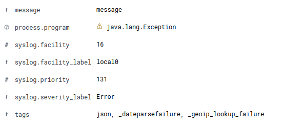

# java-log4j2-elasticsearch

Java using log4j2 send log to Redis and logstash consuming to elasticsearch

```sh
sudo apt-get install default-jdk
```

```sh
mvn archetype:generate \
    -DgroupId=com.app \
    -DartifactId=app \
    -DarchetypeArtifactId=maven-archetype-quickstart \
    -DarchetypeVersion=1.4 \
    -DinteractiveMode=false

mvn archetype:generate \
    -DgroupId=com.my-j22-site \
    -DartifactId=my-j22-site \
    -DarchetypeArtifactId=maven-archetype-j2ee-simple \
    -DarchetypeVersion=1.4 \
    -DinteractiveMode=false

cd app
mvn clean dependency:copy-dependencies package
java -cp target/app-1.0-SNAPSHOT.jar com.app.App  

mvn clean package; \
    java \
        -Dlog4j.configurationFile=file:log4j2.xml \
        -cp target/app-1.0-SNAPSHOT-jar-with-dependencies.jar \
        com.app.App 
```

## Redis

```sh
redis-cli -h localhost -x LPUSH redis1 < t.json 
```

## Post

```sh
curl -X POST \
    -H 'Content-Type: application/json' -i 'http://127.0.0.1:5444/json/' --data '{
        "message":"teste"
    }'
```

## Example

```java
public static void main(String[] args) {
        System.out.println("Te");
        logger.info("Hello, World info!");
        logger.debug("Hello, World debug!");
        logger.error("Hello, World error!");
        logger.fatal("Hello, World fatal!");
        try {
            throw new Exception("message", new Throwable("message"));
            // int b = 5 / 0;
            // throw new Exception("Exception message");
        } catch (Exception e) {
            logger.error(e,e);
        }
    }
```



